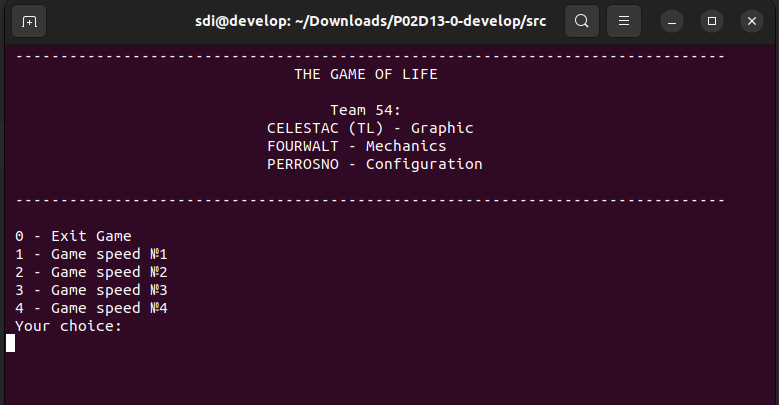
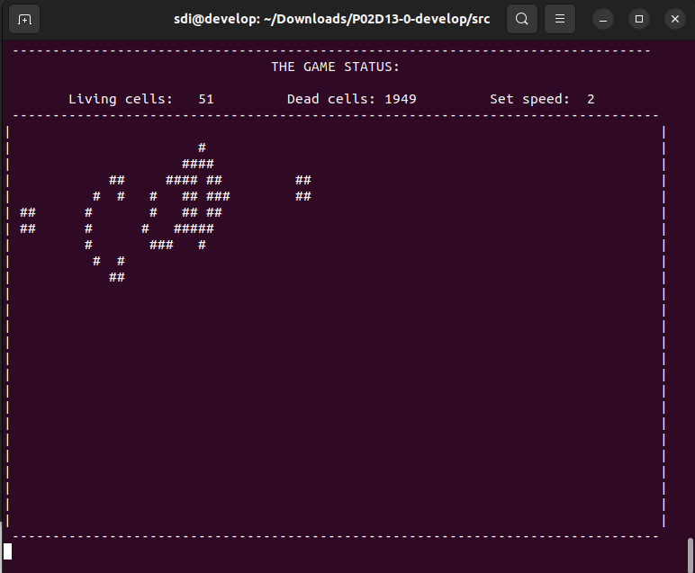

# The Game of Life

***На языке программирования Си разработать программу src/game_of_life.c, представляющую из себя визуализацию "The Game of Life". Для отображения графики использовать только символьную (ASCII) графику (с выводом в терминал). Необходимо реализовать в игре Game of life интерактивный режим, c настройкой скорости игры.***

## Графика

Поле — прямоугольник 80 на 25 клеток.
Подразумевается, что поле "замкнуто само на себя", к примеру у нижнего правого квадратика соседом справа является нижний левый квадратик, а соседом снизу - верхний правый.

Предусмотреть начальную инициализацию состояния "игры" через stdin. Подготовить как минимум 5 файлов с начальными состоянием для быстрого запуска и инициализации через перенаправление ввода.

## Важные замечания

> Игра должна быть разработана на языке Си, в структурном стиле и работать из терминала;
  
> При разработке игры в полной мере руководствоваться принципами структрного программирования Э. Дейкстры. 

## Компиляция и запуск

`gcc game_of_life.c`

`./a.out < ` <имя конфигурационного файла>

`CTRL+C` - для выхода

